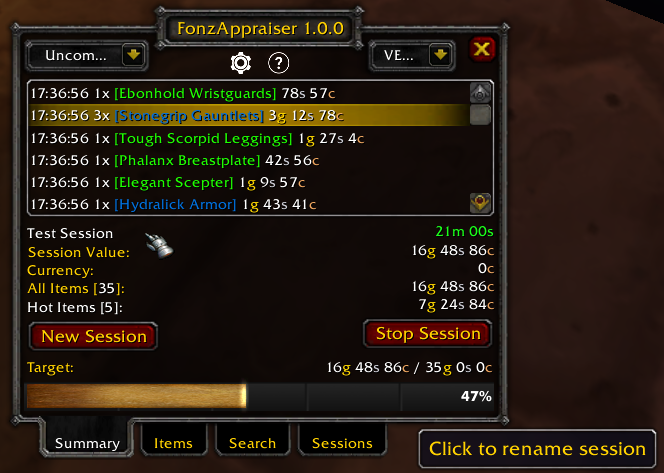
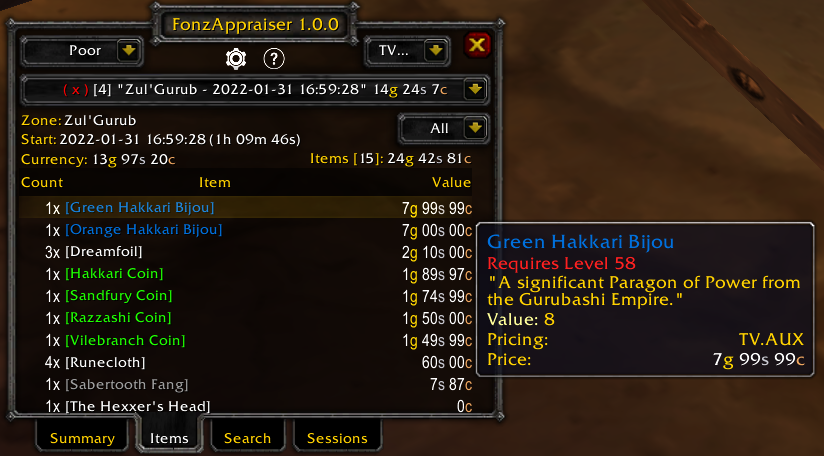
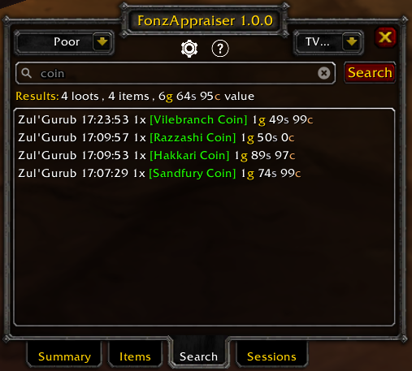
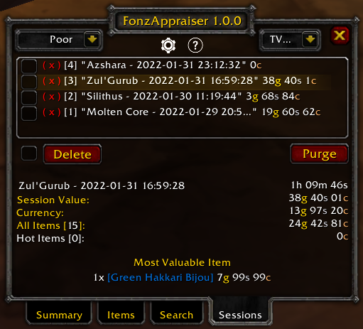

#  FonzAppraiser - World of Warcraft Addon

FonzAppraiser is an addon for World of Warcraft (1.12 and 2.4.3 clients) to 
track the value of personal loot.

## Core Features

### General
* Loot is tracked in manually started and stopped sessions.
* Sessions display timer duration and are zone-aware.
* All loot and money that is personal or shared in groups is tracked.
* Loot from corpses and ground loot from gathering nodes is tracked.
* A quick access, global item quality filter is always available.
* Loot is valued by a pricing system, with the vendor/merchant as default.
* Pricing systems currently supported: vendor, "aux-addon", and 
"Auctioneer" addons.
* Quickly switch between pricing systems at any time.
* A Target or goal for the current session value can be easily created.
* When thresholds for item value, money received or Target are met Notices can
be sent.
* Notify methods for these Notices currently support:
system (local) chat, sound, whisper, channel, group and guild.
* Keybinds supported: show main window, start new session, stop current session.

### Summary
* Start and stop the latest/current session.
* Display most recent loots and their values.
* Display current session details and allow session renaming.
* Quickly set the Target and show current session value progress to it.

### Items
* Switch between session details and with an items perspective.
* Items listed by value in descending order by default.
* Sort items by count, name or value.
* Display all items or only items where a Notice was issued ("Hot" items).

### Search
* Search through all loot across all sessions.
* Search by item name (including substring) or by specific filters.
* Display the count and value of all items found.

### Sessions
* Display all sessions and total value per session.
* Rename any session.
* Delete selected sessions or delete all sessions (purge).
* Quickly review any session details.
* Display the Most Valuable Item per session.

## Slash Commands
### General
**/fa show** - show the main window.

**/fa start** - start a new session (stops any previous session).

**/fa stop** - stop the current session.

**/fa config** - show the configuration window.

**/fa help** - show this help window.

**/fa enable** - toggle whether to show chat output for each loot.

### Extra
**/value** or **/bvalue** - show the value of items in bags (ascending value)

**/rvalue** or **/rbvalue** - show the value of items in bags (descending value)

### Advanced
**/fa search &lt;filters&gt;** - search all loots for items matching 
filters.

**/fa purge** - delete all sessions (warning: instant delete, no 
confirmation).

**/fa maxsessions &lt;number&gt;** - change maximum number of sessions 
(5 by default).

**/fa pricing &lt;string&gt;** - set the pricing system.

## Graphical Interface

### Summary

### Items

### Search

### Sessions

## Search Filters
The basic search looks for item links or parts (aka. substring) of an item name:

    dream

matches all loots with with "dream" in their name, e.g. dreamfoil herb.    

More precise or flexible searches can use search filters. Search filter syntax: 

`filter1=value1/filter2=value2/.../filtern=valuen`

Examples:

    lmin=51/lmax=60/rarity=rare
    
matches all items of minimum level 51 to 60 that are blue (rare)

    slot=finger/quality=uncommon
    
matches all rings with rarity uncommon or better

List of possible search filters:
* **count** = &lt;number: count of items in a loot&gt;
* **from** =  &lt;date: loots starting from date, e.g. 2022-01-01&gt;
* **group** = "herbalism" | "mining" | "skinning" | "fishing"
* **id** = &lt;number: item id, e.g. 18401&gt;
* **level** = &lt;number: exact item level [1-63]&gt;
* **lmax** = &lt;number: maximum item level [1-63]&gt;
* **lmin** = &lt;number: minimum item level [1-63]&gt;
* **name** = &lt;string: item name substring, e.g. dreamfoil&gt;
* **quality** = &lt;string: minimum item rarity substring, e.g. uncommon&gt;
* **rarity** = &lt;string: item rarity substring, e.g. rare&gt;
* **session** = &lt;number: session number [1-10]&gt;
* **since** = &lt;duration: loots since duration ago, e.g. 4d 10h 7m 10s&gt;
* **slot** = &lt;string: armor or weapon slot (same as auction house), 
e.g. head&gt;
* **subtype** = &lt;string: item subtype (same as auction house), 
e.g. alchemy&gt;
* **to** = &lt;date: loots up to date, e.g. 2022-01-01&gt;
* **type** = &lt;string: item type (same as auction house), e.g. recipe&gt;
* **until** = &lt;duration: loots until duration ago, e.g. 4d 10h 7m 10s&gt;
* **value** = &lt;money: minimum money value, e.g. 1g 3s 2c or 10302 &gt;
* **zone** = &lt;string: zone name substring, e.g. winter&gt;

All search filter names can be shortened to any unique starting string.
 Most string values can use substrings. So, instead of typing, `group=herbalism`
 you could type `g=herb` to show all loots containing herbs.
 
## Options - Notify Chat Fields
{zone}, {threshold}, {item}, {money}, {value}, {count}, {pricing}

These can be used inside notify chat messages like this example for Item:

`Got {count}x {item} worth {value} ({pricing}) while in {zone}!`
 
## Known Issues
* **notify guild** - some servers restrict guild chat messaging from 
addons and perhaps other types of chat messages.

## Credits

The original idea and implementation for this addon were by 
**[fondlez](https://github.com/fondlez)**.

Ever leveled to 60 on a fresh, but low population server and are now faced
with the daunting task of finding the initial gold to do ... anything? This
addon was written because I thought tracking my progress towards specific goals 
would be a lot more fun! I hope you find the same or even find other uses for
it.

### Special Credits
* **[Shagu](https://shagu.org)** - probably the most prolific addon author in 
the vanilla community! A special thank you, especially for the data mined vendor
prices and Search bar interface. Embedded license included.
* **[shirsig](https://github.com/shirsig)** - the author best known for Mail, 
Postal and Aux inspired me to cleaner code with his very different coding style.
* **[Roadblock](https://github.com/Road-block)** - the author of Interruptor and 
the vanilla backport of the amazing [Possessions addon](https://github.com/Road-block/Possessions/releases/tag/2.02g-11200) 
inspired me to make my first graphical addon with Fubar support.

### Other Addons
* **CT_ExpenseHistory** - the addon that inspired the tabbed dialog
interface. This was originally written back in 2006 or earlier!
* **LootAppraiser Classic** - thank you to ProfitzTV and co. for enabling
me to put a name to the idea for the addon and a basic look-n-feel for their
popular WoW Classic addon.
